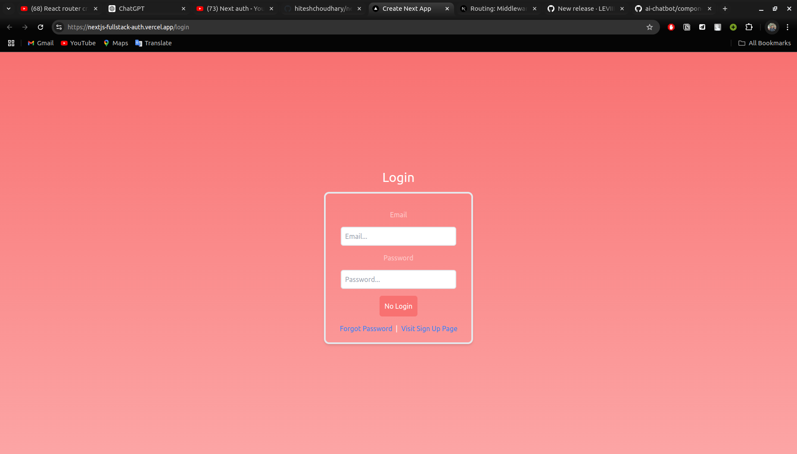
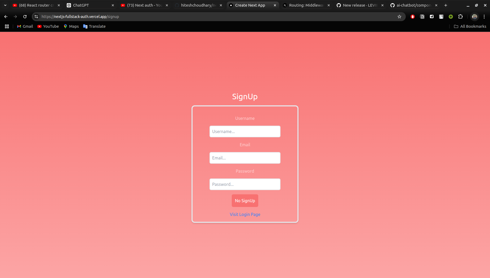

# Project Name

## Description

This project is called "auth-next" and it aims to provide a secure authentication system for web applications. It is built using the Next.js framework and follows best practices for authentication and authorization.

## Features

- User registration and login
- Password hashing and salting
- JWT-based authentication
- Role-based access control
- Account verification via email
- Password reset functionality

## Screenshots

Here are some screenshots of the application:

## Installation

1. Clone the repository: `git clone https://github.com/username/auth-next.git`
2. Install dependencies: `npm install`
3. Configure environment variables: Create a `.env` file and set the required variables.
4. Start the development server: `npm run dev`

## Usage

1. Register a new user account.
2. Log in with your credentials.
3. Explore the different features and functionalities of the application.
4. Customize the authentication system to fit your specific requirements.

## Contributing

Contributions are welcome! If you find any bugs or have suggestions for improvements, please open an issue or submit a pull request.

## License

This project is licensed under the [MIT License](LICENSE).
